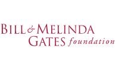

# Workshop: Introduction to R for Demographers
Held at the United Nations Population Division, August 19-30, 2019.

Instructor: Tim Riffe ([Max-Planck-Institute for Demographic Research](https://www.demogr.mpg.de/en/institute/staff_directory_1899/timothy_riffe_2198.htm) )

This repository contains all code and R markdown files used to prepare sessions. It will also contain code we produce live in session, to be cleaned annotated each day after lectures and uploaded here. Materials prepared for each session are also rendered as html viewable in your browser.

[Workshop Outline](https://timriffe.github.io/RforUNPD2019)

[Day 1, Monday, Aug. 19](https://timriffe.github.io/RforUNPD2019/Day1)

[Day 2, Tuesday, Aug. 20](https://timriffe.github.io/RforUNPD2019/Day2)

[Day 3, Wednesday, Aug. 21](https://timriffe.github.io/RforUNPD2019/Day3)

[Day 4, Thursday, Aug. 22](https://timriffe.github.io/RforUNPD2019/Day4)

[Day 5, Friday, Aug. 23](https://timriffe.github.io/RforUNPD2019/Day5)

Materials for ad hoc lectures in the second week (August 26-30) will be produced in situ, and they will be linked here as appropriate.

This workshop is carried out as part of a project commissioned by the [UN Population Division](http://www.un.org/en/development/desa/population/) and financed by the [Bill and Melinda Gates Foundation](https://www.gatesfoundation.org/) as part of the [Making Family Planning Count](http://www.un.org/en/development/desa/population/projects/making-family-planning-count/index.shtml) project. 

---
permalink: /index.html
---

